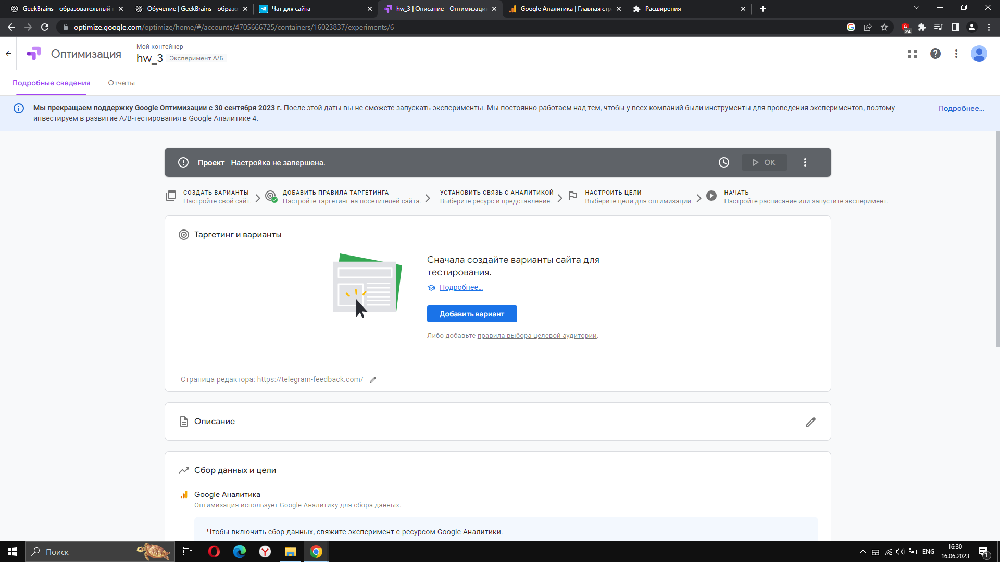

1. Создал проект hw_3. Выбрал А/В эксперимент.  
  
Заполняю проект по roadmap'у.  

2. Добавил вариант с экспериментами. Назвал - "Вариант В".  
  
Вношу изменения.
  

3. Ставлю расширение "Google Optimize".
  

4. Внес изменения: цвет фона, шрифт заголовка, цвет кнопки.  
Предполагаю, что изменение цвета кнопки увеличит конверсию на 5%.  
А изменение цвета фона и шрифт заголовка увеличит время нахождения пользователя на сайте.
  

5. Изменения сохранены.
  

6. У нас одна страница. "Таргетинг на страницы" пропускаю.  

7. Целевую аудиторию не настраивал.  

8. Добавил описание.
  

9. Создал поток в Google Analytics и получил идентификатор потока. Теперь аналитику можно подключить к сайту.  
  
  
10. После внесения идентификатора на сайт будет возможно собирать статистику.
  

11. Связываю Оптимайзер с потоком в Аналитике. Добавил цели:
  

12. Поскольку нет доступа к сайту и не могу встроить код идентификатора в сайт, отслеживать аналитику не смогу.

13. Настроил распределение трафика. Выбрал, чтобы 10% посетителей участвовало в эксперименте.
