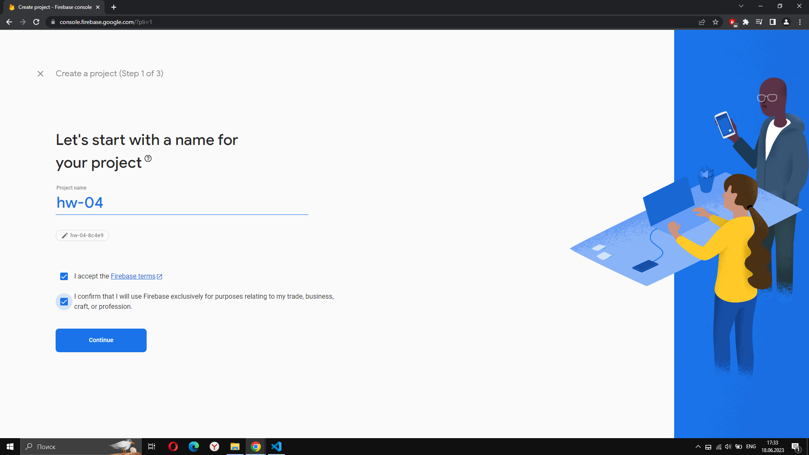
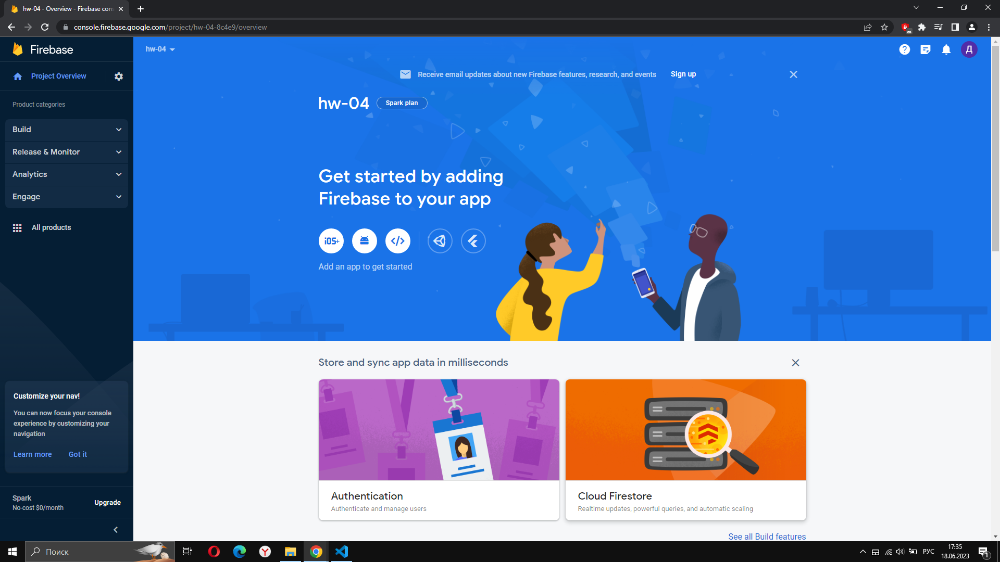
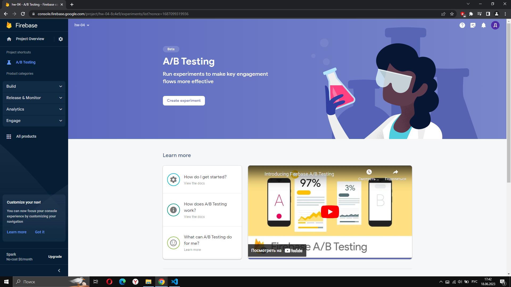
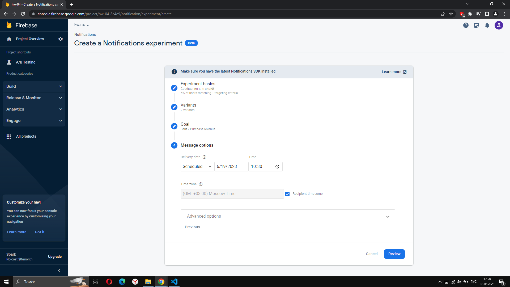
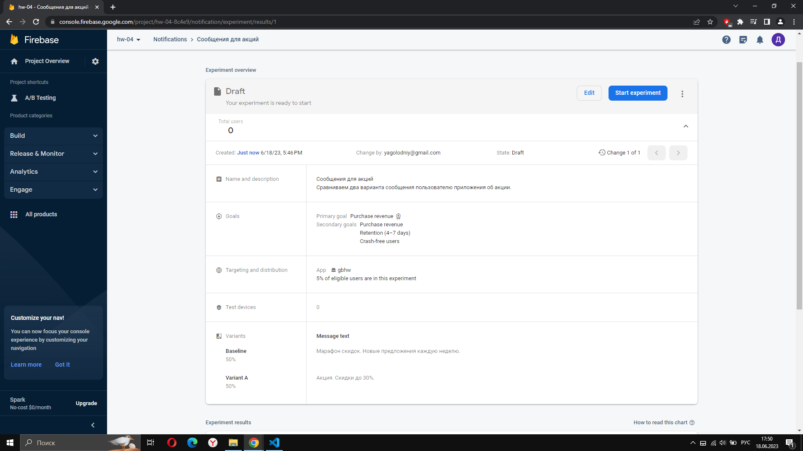
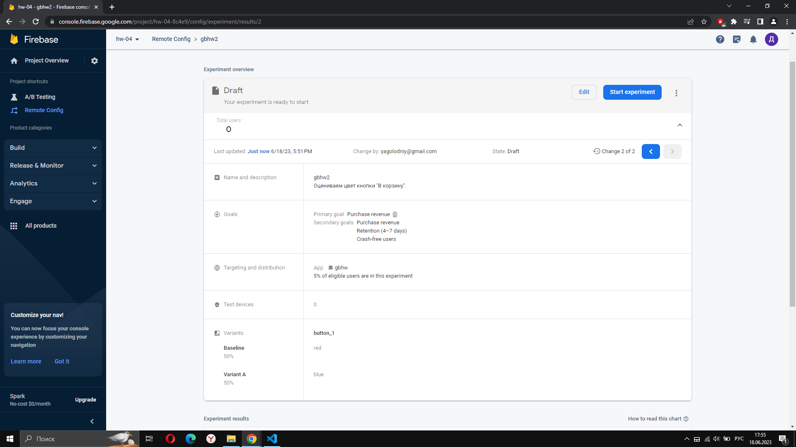
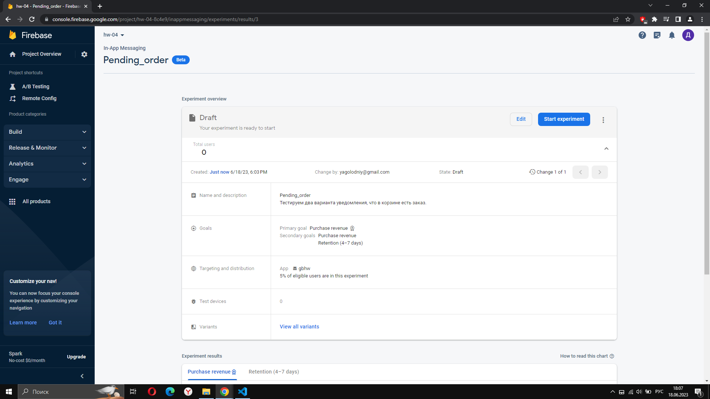
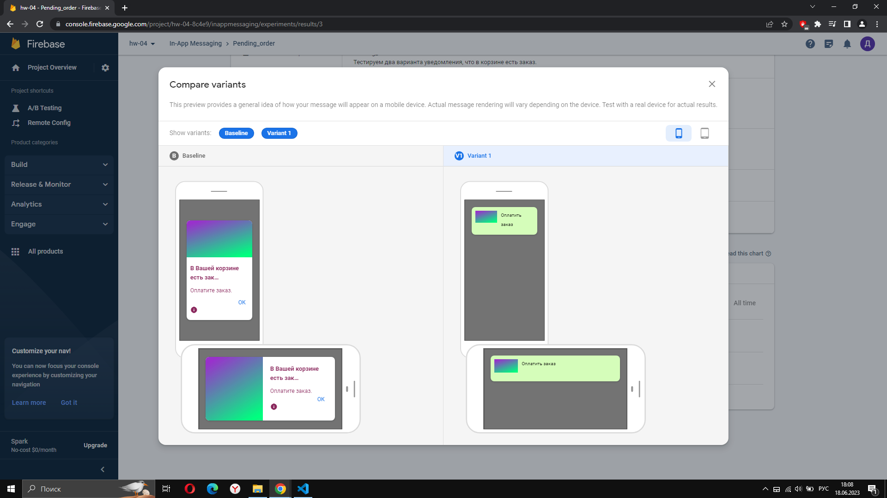
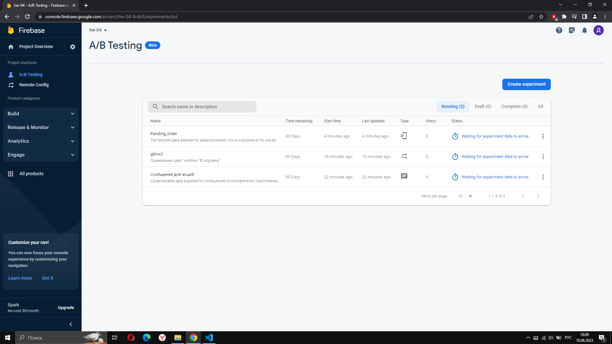

1. Создал проект. Добавил приложение.  
  
  
  
  
2. Настраиваю эксперимент - Notifications. Сравниваю два предложения. Сообщения с предложениями будут отпарвлены пользователям с учетом часового пояса по расписанию. Эксперимент планируем на 5% польователей.
  

3. Настраиваю эксперимент - Remote Config.  
  

4. Настраива. эксперимент - In-App Messaging.
  

5. Итого запущено три A/B-теста.

