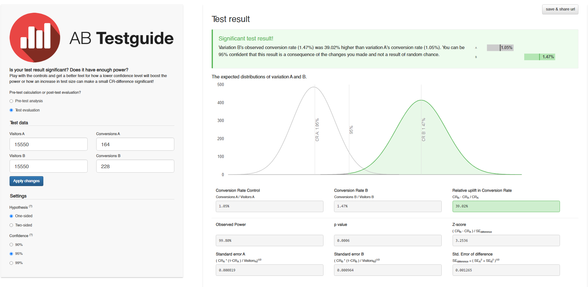

### Задание 1
Для сравнения метрик долей(конверсии/ретеншн) пользуются:  
- z - критерий;  
- критерий Хи-квадрат + Критерий Манна Уитни для сравнения ненормально распределенных величин;  
- с помощью доверительного интервала или p-value.

Если p-value больше или равено уровню значимости, значит на основе собранных данных статистически значимой разницы между группами не обнаружено.
Если p-value меньше уровня значимости, то между группами есть статистически значимая разница.  
В нашем случае уровень значимости α=5%.  
Использую [калькулятор](https://abtestguide.com/calc/?ua=15550&ub=15550&ca=164&cb=228) для расчета:  
  
  
**Статистически значимые различия между конверсиями в двух группах есть.  
Можем утверждать, что увеличение конверсии является следствием упрощения формы заказа.  
Стоит использовать новую форму заказа.**
   
### Задание 2
Нам понадобится критерий для анализа различий между группами.  
Тип данных: непрерывные количественные (конверсия в покупку может быть дробным числом).  
Распределение: считаем, что распределение нормальное. Будем работать с параметрическими критериями.  
Количество сравниваемых групп: не уточнено.  
Связанность групп: группы не связаны.  
**Если количество сравниваемых групп равно 2, используем Т-критерий Стьюдента для независимых выборок.  
Если количество сравниваемых групп 3 и больше используем дисперсионный анализ.**
