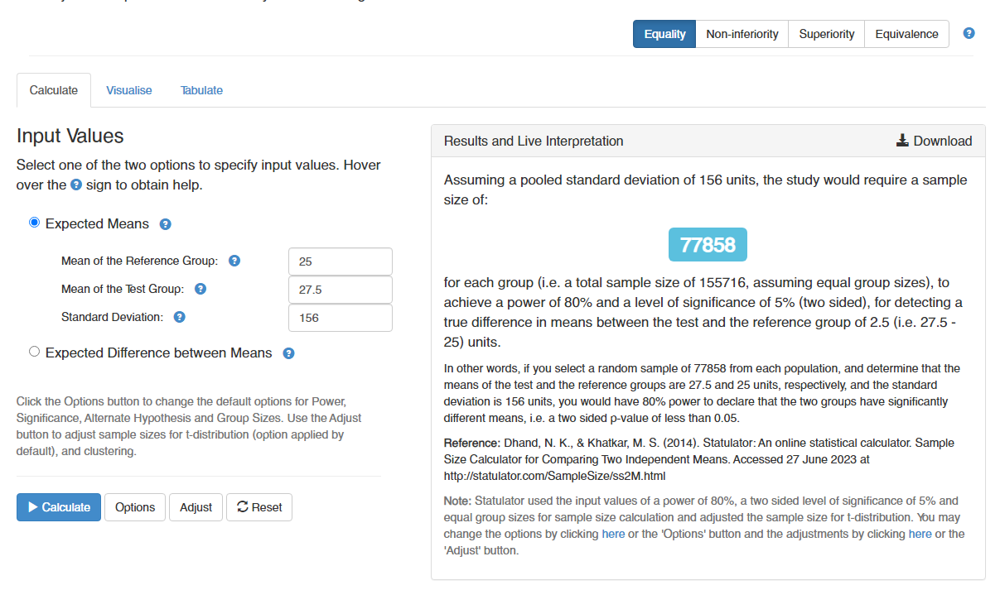
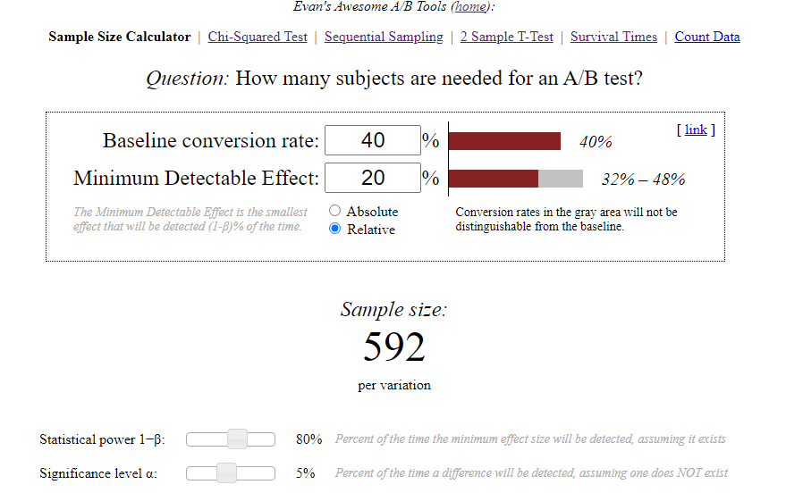

#### Задание 1  
Продакт на главной mail.ru решил протестировать в рекомендательной ленте контента вместо карточек со статьями видеоплеер с короткими видео. Нынешний таймспент на юзера в день в среднем равен 25 минут, а стандартная ошибка (SD) равна 156. Мы предполагаем, что в новой версии таймспент на юзера в день изменится на 10%. Средний трафик 20000 человек в день. Посчитайте сколько дней необходимо держать эксперимент при alpha = 5% и beta = 20%.  

По калькулятору нахожу размер выборки для одной группы:
  
  
Размер каждой выборки равен 77 858 юзеров.  
Если запускаем эксперимент, как A/B-тест, то общий размер выборки составляет 155 716 юзеров.  
При среднем трафике 20 000 юзеров в день эксперимент для одной выборки продлится 3,9 дня при условии, что весь трафик участвует в эксперименте.  
#### Задание 2
Наша продуктовая команда в ecommerce магазине планирует запустить тест, направленный на ускорение загрузки сайта. Одна из основных метрик bounce rate в GA = 40%. Мы предполагаем, что при оптимизации сайта она изменится минимум на 20%.Средний трафик 4000 человек в день. Посчитайте сколько нам нужно дней держать эксперимент при alpha = 5% и beta = 20%.  

По калькулятору нахожу размер выборки для одной группы:   
  
Изменение в 20% выбрал как относительное к 40%. Думаю, при такой постановке задачи вернее измерять по отношению к основному показателю.  
Размер каждой выборки равен 592 юзера.  
Если, все-таки, нужно использовать абсолютное изменение (+/-20%), то достаточно в калькуляторе переключить чекбокс на "Absolute".  
При среднем трафике 4000 юзера в день для одной выборки эксперимент продлится 6,7 дня, при условии, что весь трафик участвует в эксперименте.  
